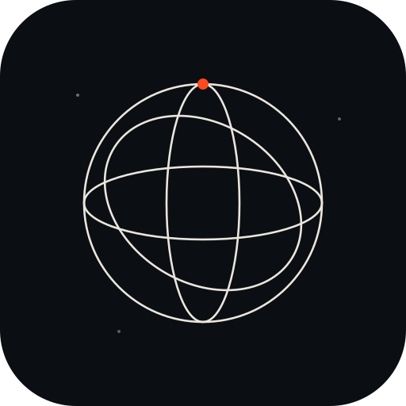

<p align="center">
  
</p>

# Sphere plugin

Status: v1.

The Sphere plugin is a local Claude desktop extension (MCPB) for working with
agent-readable content "fragments." It runs on your machine over stdio. There is
no hosted server, no sign-in, and nothing to deploy. It hosts nothing and stores
nothing.

It has two tiers of tools.

## Local tools (no configuration, no network)

These operate on fragment files on your disk and work out of the box.

- `validate_fragment` - structural validity of a fragment against the Sphere
  fragment schema. Returns PASS or FAIL with a list of structural errors.
- `analyze_fragment_readiness` - advisory readiness gaps that are not hard errors
  (missing sources, media without descriptions, unclear or missing license, data
  without a schema, missing canonical_url), each with a severity and a suggestion.
- `generate_fragment_report` - validation plus readiness in one readable report,
  for a single fragment or a directory of fragments. The report includes a
  "Rights and risk" placeholder that notes rights and risk analysis is not part of
  v1.
- `prepare_fragment` - scaffold and write a new fragment (sphere.json +
  content.md) from fields and Markdown body you provide, then validate it.

## Node tools (read-only, your own Sphere Node)

These query the owner face of a Sphere Node that you run yourself. They are
read-only and they only ever call the single Node URL you configure.

- `get_publisher_summary` - GET /owner/summary
- `get_fragment_usage` - GET /owner/fragments/{id}/usage
- `get_payment_status` - GET /owner/payments

If you have not set a Node URL and token, these tools do not fail. They explain
how to configure them, and the local tools keep working regardless.

## Configuration

Both settings are optional. The plugin is useful with neither set.

- Sphere Node URL (`sphere_node_url`) - the base URL of your own Sphere Node, for
  example `https://node.example.com`.
- Sphere Node Token (`sphere_node_token`) - the owner bearer token for your Node.
  It is marked sensitive and stored in your operating system keychain, never in a
  file in this repository.

Set them in the extension's settings in Claude Desktop after installing the
bundle. They are passed to the local server as environment variables; the token
is not written to disk by this plugin.

## Privacy

This plugin stores nothing and sends nothing anywhere except to the Sphere Node
you configure, authenticated with the token you provide.

- No telemetry, no analytics, no third-party services.
- The local fragment tools never touch the network at all.
- The Node tools call only your configured `sphere_node_url`. They never call a
  URL taken from fragment content, tool arguments, or any other source.
- Your token is stored in the OS keychain by Claude Desktop and is sent only as a
  bearer token to your own Node.
- Questions, support, or privacy requests: email hello@sphere.pub.

## Build and package

```bash
npm install
npm test            # vitest
npm run typecheck   # tsc --noEmit
npm run build       # bundle src/ into server/index.js (esbuild)
npm run pack        # build, then produce dist/sphere-plugin.mcpb
```

`npm run pack` writes `dist/sphere-plugin.mcpb`, which you can install in Claude
Desktop. The server is a single self-contained bundle: it ships no node_modules
and no native dependencies.

## The fragment contract

The fragment schema and the Node response types are vendored from the
`sphere-node` repository into `src/contract/`. That repository is the source of
truth for the contract; this plugin consumes it and does not redefine it.

## License

The Sphere plugin source code is licensed under the
[Apache License 2.0](LICENSE).
